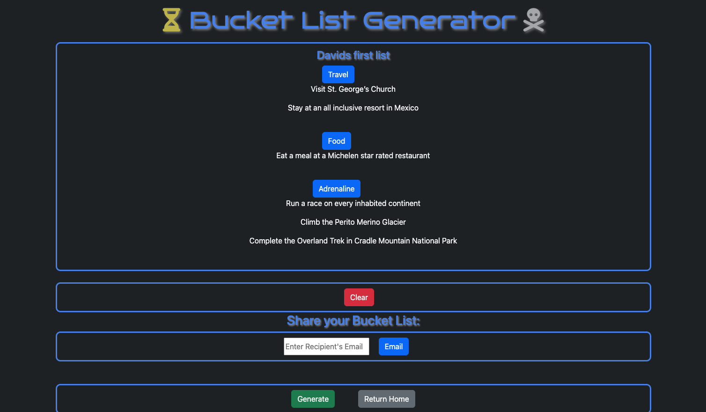

# BucketList Generator

## Description

The motivation behind building this application was the desire to create something for users who are stuck in the rut of life and need some inspiration to break out of their daily routine. The bucketlist generator is a unique app that can spark the users imagination and drive them to pursue life changing events or activities.

Through building this project, our team was able to build our individual skills with express js, handlebars, and node js, as well as gain experience in collaboration with full stack developers.

## Installation

No installation required.

## Usage

Click this [link](https://pacific-beach-42449.herokuapp.com/) to access the application. After the page loads, scroll to the bottom and click the login button. Sign up with the required fields if you are a new user, or fill out the login section if you are a returning user. You will be met with the following page:

 

 Click on any of the hyperlinked lists to add to them or enter a list name and click the create list button to create a brand new list.

 Once you click on the list you will be taken to the editor page where you can edit and share the bucketlist. Click the "generate" button to generate bucketlist ideas and click either the "Travel", "Food", or "Adrenaline" category buttons to add the idea to the correct category.

 

 Your bucketlist will be saved and posted to the homepage!

## Credits

Collaborators:

[Lukas Durkin](https://github.com/DukeLurkin)
[Andrew Dean](https://github.com/0Adean0)

